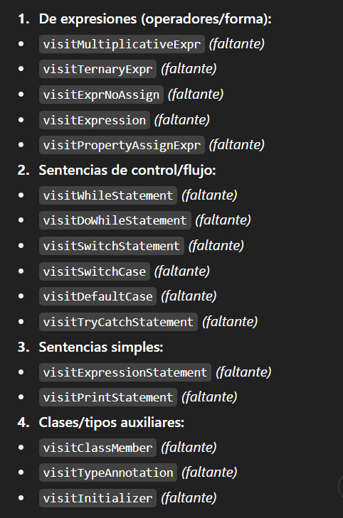

# 🍏 TODO

---

## ✅ Finish the TypeChecker implementation

In the image below you’ll find the list of missing visit\* methods that must be implemented in `TypeChecker`:  


---

## 🗂 Files to edit

### Program

- `program/src/typeChecker/TypeChecker.py`

### Test

- `program/src/test/test_type_checker.py`

---

## 💩 Example

### 🧭 How to implement visitMultiplicativeExpr

You must validate operand types for \*, /, and %:

- int \* int → int
- int _ float (or float _ int) → float
- float \* float → float
- int % int → int (only integers; no floats)

_Skeleton to start from:_

```python
def visitMultiplicativeExpr(self, ctx):
    n = ctx.getChildCount()
    if n == 1: # Esto ponelo porque lol aun no entiendo por que entrar caracteres simples.
        return self.visit(ctx.getChild(0))

    left  = self.visit(ctx.getChild(0))
    op    = ctx.getChild(1).getText()
    right = self.visit(ctx.getChild(2))
```

### 🧠 How to discover what ctx provides

If you’re not sure what methods a context has:

1. Hover the parameter in your editor (ctx) to see its type, e.g. MultiplicativeExprContext.
2. Open CompiscriptParser.py (generated by ANTLR).
3. Search for class MultiplicativeExprContext(ParserRuleContext):. You’ll see something like:

```python
class MultiplicativeExprContext(ParserRuleContext):
    __slots__ = 'parser'
    def unaryExpr(self, i:int=None):
        if i is None:
            return self.getTypedRuleContexts(CompiscriptParser.UnaryExprContext)
        else:
            return self.getTypedRuleContext(CompiscriptParser.UnaryExprContext,i)
    def getRuleIndex(self):
        return CompiscriptParser.RULE_multiplicativeExpr
    # ... enterRule/exitRule/accept ...
```

This tells you which child getters exist (e.g., getChildreCount()), and confirms the node structure.

---

## 🧪 Tips for testing

- Add unit tests that cover:
  - int _ int, int _ float, float \* float
  - int / int, float / int
  - alid % (int % int) and invalid % with floats

---

## 🧐 Extra tip

You can always check the file `Compiscript.g4` to understand the grammar what parse tree nodes each rule produces and what the rest of the compiler expects.
